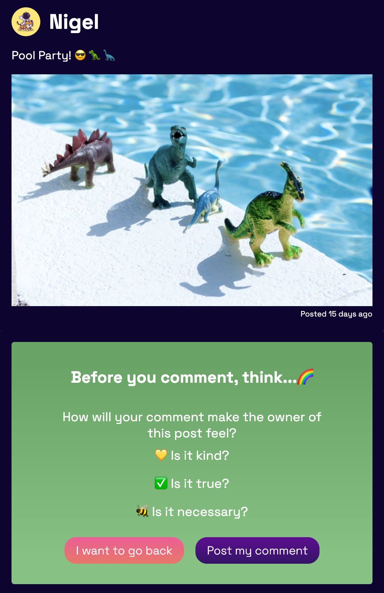
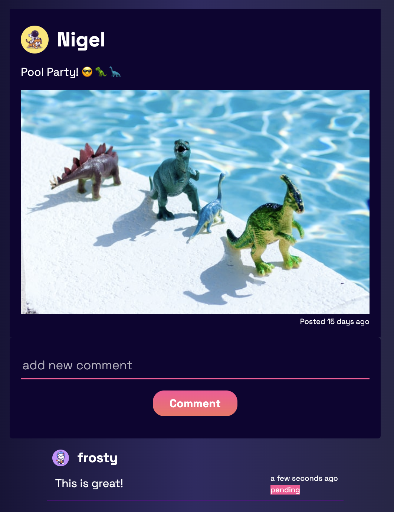
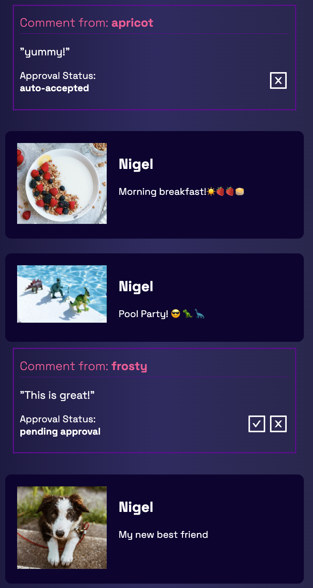
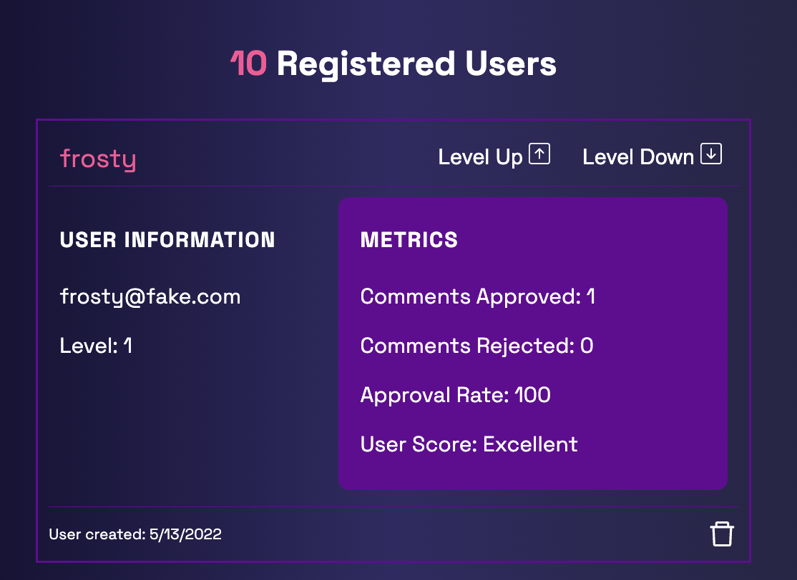

# LiftOff

LiftOff is a social media app designed for children between the ages of 8-10. This site is meant to guide children into the world of social media while teaching them digital citizenship skills.

### Highlights

- level 1 users can post a comment which must be approved by an admin
- admin can approve or reject comments which determines whether other users can see the comment
- admin can increase or decrease a user's level
- level 2 users can freely comment
- level 3 users can create posts
- when a user comments, sentiment analyzes the input and produces a score
- if the score is less than the minimum, the user cannot post their comment
- all users are asked to reflect before posting a comment and must confirm their comment
- avatars are assigned based on level for privacy

### Images

- After a user creates a comment which has passed the filter:

  

- A comment will be displayed as pending until it is approved by admin:

- Admin dashboard:

  

- User info:

  

### Stack

- React
- React-Router
- Axios
- Ruby on Rails
- Bcrpyt
- PostgreSQL
- imgBB

## Getting Started

1. Clone the repository
2. Open two terminals
3. In the project's home directory run `bundle` to install the necessary gems
4. create the .env file based on the .env.example
5. Run `rails s` to start the rails server.
6. `cd client` in the second terminal
7. `npm install` to install dependencies
8. in client, run `npm start`

### Dependencies

- axios
- form-data
- moment
- node-sass
- react
- react-dom
- react-router
- react-timer-hook
- sentiment
- use-timer
- bcrypt
- rails

## Contributors

[Rhiannon Krowchuk](https://github.com/rkrowchuk)

[Jasper Maynard Lim](https://github.com/JLMaynardDesign)

[Kelsi Olstad](https://github.com/kel-si)
